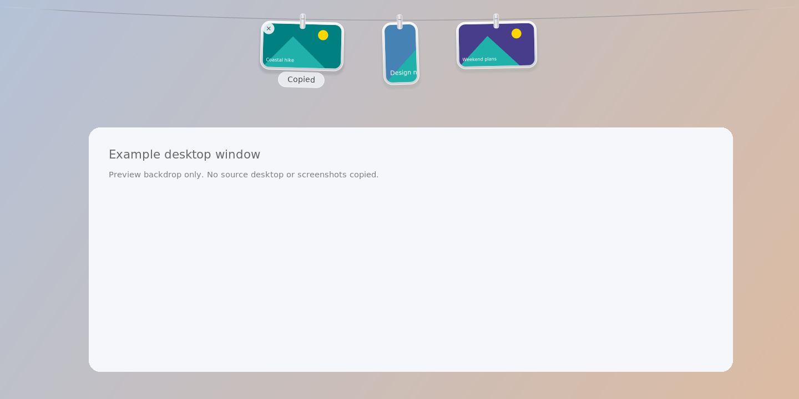

<h1 align="center">Snapline</h1>

<p align="center">
  A little space for your screenshots.<br>
  Free, open source, and built for Windows 11.
</p>

<p align="center">
  <a href="#download">Download</a> &nbsp;·&nbsp;
  <a href="#the-small-moves">Controls</a> &nbsp;·&nbsp;
  <a href="#build-from-source">Build from source</a>
</p>

<br>

## Keep the screenshot. Keep your place.

Snapline puts recent captures on a thin line at the top of your display. Rest your pointer at the top edge to bring them down. Move away and the line slides out of view.

Small silver clips, rounded frames, and a gentle sway. No toolbar or extra window to work around.

<p align="center">
  
</p>

<p align="center">
  <sub>Renderer preview with sample images and a drawn backdrop. Not a Windows desktop screenshot.</sub>
</p>

> **Early Windows build:** v1.1 builds successfully and has passed non-Windows tests. Native Windows integration has not yet been tested on a Windows 11 machine. See [Testing and limits](#testing-and-limits).

<br>

## The small moves

| Gesture | Result |
| :-- | :-- |
| Click a card | Copy the image, ready to paste. |
| Double-click | Open it in your default image viewer. |
| Press and hold | Edit the original in Paint. |
| Drag into an app | Send the file to an app that accepts file drops. |
| Drag into File Explorer | Copy or move, as chosen by the destination. Moved originals leave the line. |
| Hover over a card | Show its corner cross. |
| Click the cross | Take down a watched/imported image without deleting it. For a capture in Snapline's Inbox, ask before recycling it. |
| Right-click | Copy, open, edit, save a copy, show in folder, take down, or recycle. |
| Rest at the top edge | Reveal the line on that display. |
| Move away | Slide the line out of view. |

The line fits your display width. When it fills up, older cards leave the line, but their files are kept. Your last shelf is restored when you next open the app.

### Shortcuts

| Keys | Action |
| :-- | :-- |
| <kbd>Ctrl</kbd> + <kbd>Alt</kbd> + <kbd>T</kbd> | Show or hide the line. |
| <kbd>Ctrl</kbd> + <kbd>Alt</kbd> + <kbd>S</kbd> | Capture a region with Windows Snipping Tool. |
| <kbd>Ctrl</kbd> + <kbd>Alt</kbd> + <kbd>P</kbd> | Capture the display under your pointer. |

Use the tray menu to keep the line visible, import images, manage watched folders, or quit. If another app has a shortcut already, use the tray instead.

<br>

## Capture your way

Snapline watches `Pictures\Screenshots` and its own capture Inbox. New or changed images appear after the file has finished writing.

Use **Add a screenshot folder** in the tray menu for OneDrive, a custom save location, or another capture tool. Use **Import images** for files you already have.

Region capture needs Snipping Tool's clipboard copy enabled. Captures made with <kbd>Win</kbd> + <kbd>Shift</kbd> + <kbd>S</kbd> can also be collected through **Add clipboard image**.

Automatic clipboard collection is optional and **off by default**. If enabled, it can save any newly copied image, not only screenshots. Snapline does not change Windows screenshot settings.

<br>

## On your PC, not on a server

Snapline has no accounts, analytics, uploads, or network requests.

| Data | Location |
| :-- | :-- |
| Captures made by Snapline | `%LOCALAPPDATA%\Snapline\Inbox` |
| Preferences and shelf list | `%LOCALAPPDATA%\Snapline\settings.xml` |
| Imported or watched images | Their original folders |

Files are not automatically purged. Opening or sharing an image can launch another application, whose behavior and privacy settings are separate.

<br>

## At a glance

| | |
| :-- | :-- |
| Target platform | Windows 11 |
| Version | 1.1 |
| Built with | C#, Windows Forms, and Win32 layered windows |
| Runtime | .NET Framework 4.8, included with Windows 11 |
| Image formats | PNG, JPEG, BMP, GIF, TIFF |
| Languages | English |
| Network access | None in the app |
| Installation | Portable executable; extract and run |
| License | MIT; upstream notices retained |

<br>

## Download

**A downloadable release has not been published yet.** When the ZIP is attached to a release, it will appear on the [Releases page](https://github.com/dayumcodes/Snapline/releases). GitHub's automatic source-code ZIP is not the ready-to-run app.

If you already have `Snapline-Windows11-v1.1.zip`:

1. Extract the entire ZIP to a folder such as `Documents\Snapline`.
2. Quit an older Snapline instance from its tray menu, if one is running.
3. Double-click `Snapline.exe` in the extracted folder.
4. Look for its icon beside the clock, including inside the hidden-icons arrow.
5. Press <kbd>Ctrl</kbd> + <kbd>Alt</kbd> + <kbd>T</kbd> to show the line.

No compiler, Node, Python, administrator access, or additional runtime installation is needed on a standard Windows 11 system. Paint and Snipping Tool must be installed for their respective actions.

The executable is **unsigned**. Windows may show an unknown-publisher or SmartScreen warning. Keep Windows security protections enabled. If your organization's policy blocks unsigned apps, use its approved review and signing process.

<details>
<summary>Startup and removal</summary>

Snapline does not add itself to startup. To start it when you sign in, create a shortcut to `Snapline.exe`, open <kbd>Win</kbd> + <kbd>R</kbd>, enter `shell:startup`, and place the shortcut there.

To remove the app, quit it from the tray and delete its program folder. Keep any captures you want before optionally deleting `%LOCALAPPDATA%\Snapline`.

</details>

<br>

## Build from source

Install a .NET SDK, version 8 or newer, then run:

```powershell
git clone https://github.com/dayumcodes/Snapline.git
cd Snapline\Source
dotnet build -c Release
```

On Windows, the executable is written to:

```text
Source\bin\Release\net48\Snapline.exe
```

The build downloads Microsoft's .NET Framework reference assemblies through NuGet. These build dependencies are not needed to run the packaged app.

<details>
<summary>Inside the project</summary>

| File | Purpose |
| :-- | :-- |
| `Source/Program.cs` | Shelf rendering, card gestures, animation, capture, file watching, tray controls, and settings. |
| `Source/Snapline.csproj` | .NET Framework target and build configuration. |
| `Source/app.manifest` | Windows compatibility, DPI awareness, and standard-user execution. |
| `Source/snapline.ico` | Snapline's original icon. |
| `BUILD-VERIFICATION.txt` | Recorded cross-build and non-Windows test results. |
| `LICENSE.txt` | License for the Windows implementation. |
| `LICENSE-UPSTREAM.txt` | Original attribution and upstream name/icon restrictions. |

Run the helper checks from a console:

```powershell
.\Source\bin\Release\net48\Snapline.exe --self-test
```

The distributed v1.1 package also includes a Windows smoke-test checklist and a video-match document.

</details>

<br>

## Testing and limits

The v1.1 executable cross-build completed with **zero warnings and zero errors**. Tests under Mono/Xvfb covered file watching, image copying, persisted shelf restoration, safe removal, missing-file pruning, capacity, image loading, and settings recovery. Renderer checks covered transparent empty pixels, proportionate cards, hover/copy feedback, and hidden/falling frames.

**No real Windows 11 test run has been completed.** Layered-window composition and click-through, focus behavior, tray integration, global hotkeys, Snipping Tool, Explorer drag/drop, Paint, Recycle Bin, full-screen detection, and multiple-monitor/DPI behavior remain unverified on Windows. This is an early build, not a certified release.

Snapline is an independent Windows adaptation of [Tendedero](https://github.com/alejandrobujan/tendedero), not a pixel-identical macOS port. Translucent frames stand in for Apple's native glass material. Paint and the default image viewer replace Markup and Preview. The Windows top edge replaces the macOS menu bar. Precise source-area capture flights and Apple-specific desktop integration are not reproduced.

<br>

---

<p align="center">
  <sub>
    Windows implementation under the <a href="LICENSE.txt">MIT license</a>.<br>
    Inspired by Tendedero by Alejandro Buján. Independent project; not an official release or endorsement.<br>
    The upstream license excludes its name and icon, so Snapline uses different branding.<br>
    See <a href="LICENSE-UPSTREAM.txt">upstream license and attribution</a>.
  </sub>
</p>
